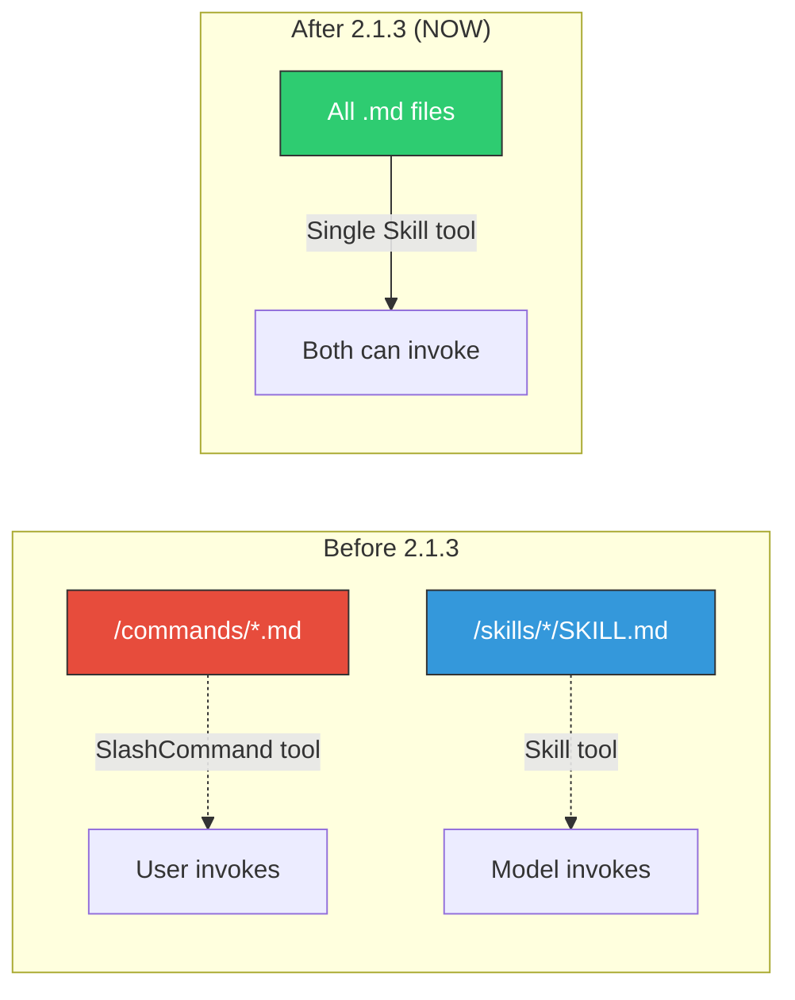
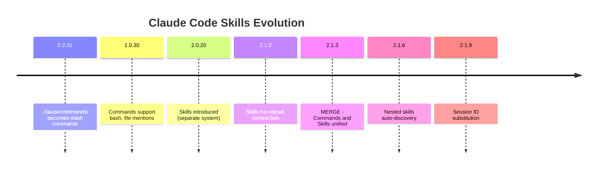
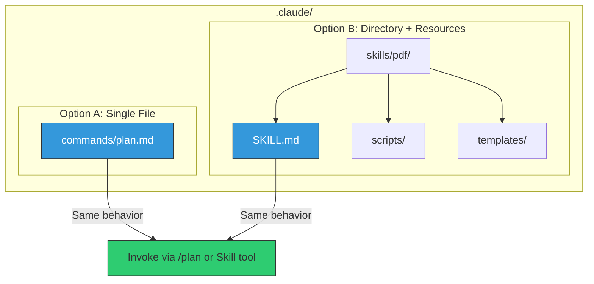
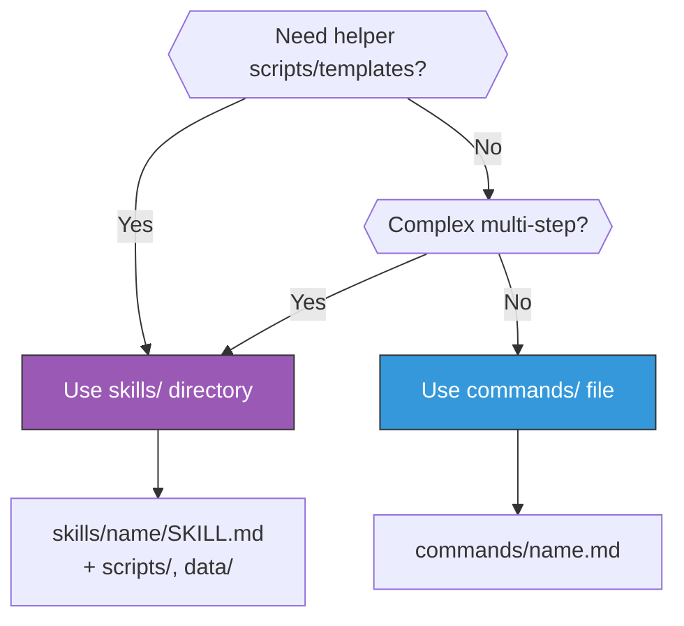
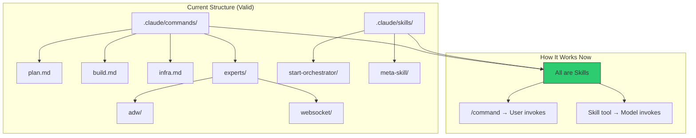
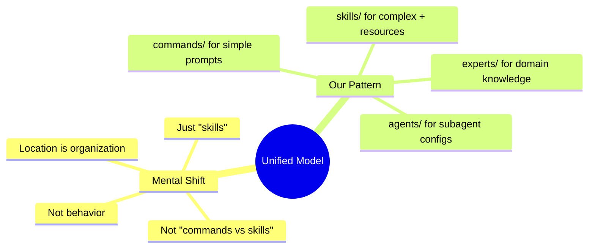
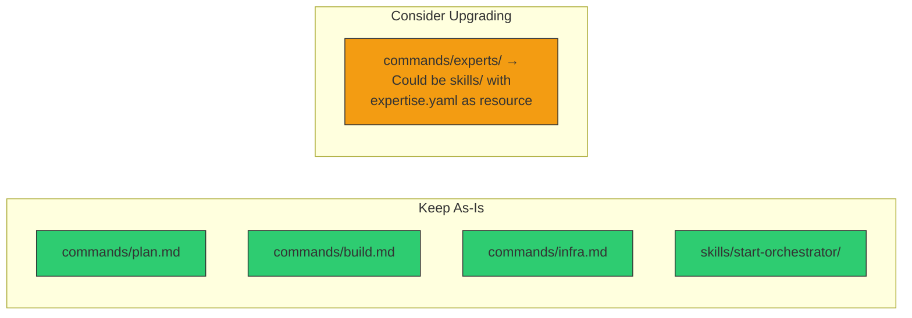

# Unified Skills Model: Commands + Skills = One System

**Date**: 2026-01-16 | **Version**: Claude Code 2.1.3+

---

## The Change



---

## Timeline



---

## What Changed

| Aspect | Before | After |
|--------|--------|-------|
| **Tools** | `SlashCommand` + `Skill` | Single `Skill` tool |
| **Invocation** | Commands = user, Skills = model | Both can be either |
| **Location** | `/commands/` vs `/skills/` | Both work the same |
| **Behavior** | Different systems | Identical behavior |
| **Frontmatter** | Similar but separate | Unified spec |

---

## Unified File Structure



---

## When to Use Each



| Scenario | Recommendation |
|----------|----------------|
| Simple prompt/workflow | `commands/name.md` |
| Needs scripts | `skills/name/SKILL.md` |
| Needs templates/data | `skills/name/SKILL.md` |
| Expert domain knowledge | `commands/experts/domain/` |

---

## Frontmatter Reference

```yaml
---
# Identity
name: skill-name              # Display name
description: What it does     # Shows in /help and tool list

# Invocation Control
user-invocable: true          # Show in slash menu (default: true)
disable-model-invocation: false  # Prevent Skill tool use

# Execution
allowed-tools: Read, Glob, Bash  # Tool whitelist
model: opus                   # Force specific model
context: fork                 # Run in forked context

# Arguments
argument-hint: [file] [options]  # Help text for args
---
```

---

## Impact on Our Repository



### No Changes Needed

| Current | Status | Reason |
|---------|--------|--------|
| `commands/*.md` | Works | Unified as skills |
| `skills/*/SKILL.md` | Works | Native format |
| `experts/*/expertise.yaml` | Works | Custom pattern |
| `agents/*.md` | Works | Task tool pattern |

---

## Key Insight



---

## Migration Recommendations



| Decision | Action |
|----------|--------|
| Keep structure | Yes - works with unified model |
| Rename commands → skills | Optional - no behavior change |
| Move experts to skills | Consider - enables helper scripts |

---

## Summary

```
BEFORE                           AFTER
══════                           ═════
commands/ = user-invoked    →    All are "skills"
skills/ = model-invoked     →    All can be either
SlashCommand tool           →    Single Skill tool
Two mental models           →    One mental model
```

**Bottom Line**: Our current structure is valid. The merge simplified Claude Code internals without requiring changes from us.

---

## Sources

- [Claude Code Changelog](https://github.com/anthropics/claude-code/blob/main/CHANGELOG.md)
- [Claude Code Skills Documentation](https://code.claude.com/docs/en/skills)
- [Slash Commands Documentation](https://code.claude.com/docs/en/slash-commands)
- [Inside Claude Code Skills - Mikhail Shilkov](https://mikhail.io/2025/10/claude-code-skills/)
